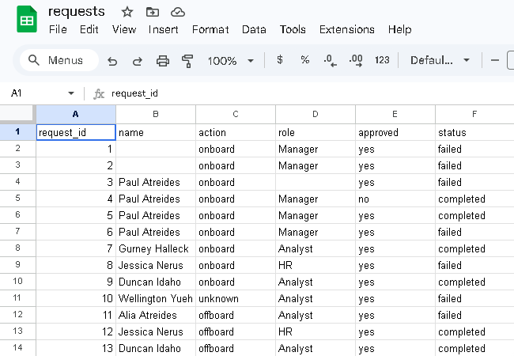

# Automated Employee Onboarding System

This program goes through the fundamental steps of an automated employee onboarding/offboarding system. The Python script reads an Excel file of onboarding and offboarding requests. The script uses this input to update the internal JSONs that represent the current state of every employee. The script either adds new employees and assigns them security access according to their roles, or for leaving employees, it marks them as inavtive and removes their security access. Then it updates the Excel sheet and logs the requests as completed, failed, or still pending.

Much of the code is dedicated to security and edge cases. Every request requires approval with it. Requests that are missing a name or role are rejected. Employees with an unrecognized role are added but not assigned permission. Duplicate names are rejected, which would be a problem in large companies. The program could be improved by assigning a unique ID to each employee so that people would the same name could work for the same company.

